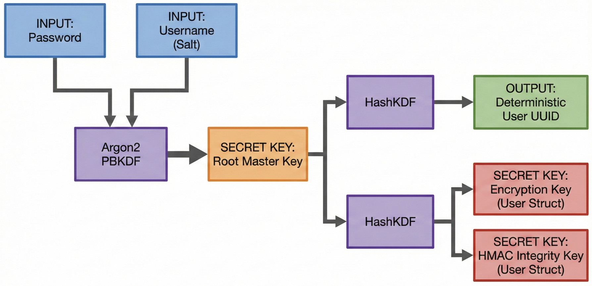
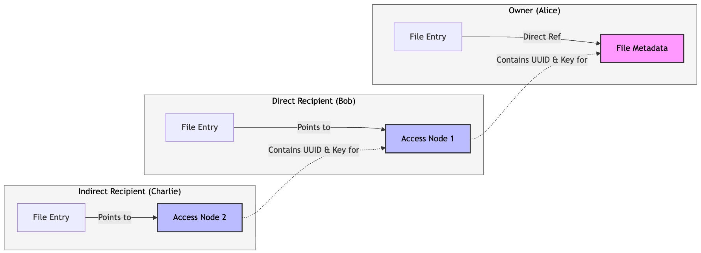
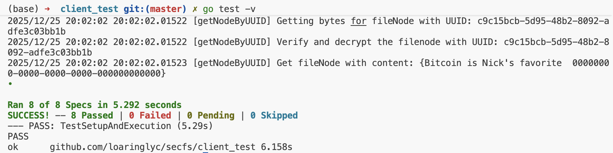

# Secure Distributed File System: Design Report

## 1. System Architecture Overview

This project implements a secure, client-side encrypted file sharing system. The architecture assumes a "trust-no-one" model regarding the storage server (Datastore). The client is responsible for all cryptographic operations, ensuring that the Datastore only ever sees encrypted data (ciphertext) and HMAC signatures, effectively preventing the server from reading or tampering with user data without detection.

### 1.1 Cryptographic Primitives
The system utilizes a hybrid cryptographic scheme combining symmetric and asymmetric primitives:
*   **Key Derivation:** `Argon2` is used for high-entropy password hashing, and `HashKDF` (Key Derivation Function based on HMAC) is used to deterministically derive sub-keys for specific purposes (encryption, MAC, UUID generation) from a master `SourceKey`.
*   **Symmetric Encryption:** Data confidentiality is secured using AES-CTR (implied by `userlib.SymEnc`).
*   **Data Integrity:** To ensure data has not been tampered with, we employ an **Encrypt-then-MAC** scheme using HMAC (Hash-based Message Authentication Code). Every entry stored in the Datastore contains `{Ciphertext, Hash}`.
*   **Public Key Infrastructure (PKI):** RSA (or similar) is used for secure invitation exchange (`PKEEnc`/`PKEDec`), and Digital Signatures (`DSSign`/`DSVerify`) are used to prove the authenticity of invitations.

### 1.2 Data Persistence Strategy
All data structures (`User`, `FileNode`, `FileMetadata`, `AccessNode`) are serialized to JSON, encrypted, and MAC-ed before being stored in the global Key-Value store. UUIDs are strictly generated either randomly (for file nodes) or deterministically via HMAC (for user structs) to prevent collisions and information leakage.

---

## 2. User Authentication and Session Management

The authentication architecture operates on a stateless, client-centric security model that eliminates the need for trusted server-side session management. By assuming an untrusted Datastore, the system relies entirely on deterministic cryptography to bootstrap the local client environment, ensuring that user identity and cryptographic capabilities are rooted solely in the user's secret credentials.

### 2.1 Initialization (`InitUser`)

A master bootstrap key is synthesized from the user's password and username (acting as salt) using the **Argon2** key derivation function. This resource-intensive algorithm is selected specifically to impose a high computational cost on offline dictionary and brute-force attacks.

The system automatically provisions a cryptographic identity for the user by generating distinct RSA key pairs for asymmetric encryption (PKE) and digital signatures (DS). Public components are published to the global Keystore to facilitate sharing, while private components remain strictly client-side.

To ensure key independence, a random symmetric **SourceKey** is generated to serve as the master secret for all file encryption operations. This SourceKey, along with the private PKI keys, is encapsulated within a User structure. This structure is serialized, encrypted via the bootstrap key, and persisted to the Datastore, ensuring that a password change only requires re-encrypting the user struct, not the entire file system.



### 2.2 Login (`GetUser`)
The system enforces location transparency by computing the storage UUID of the user's data blob strictly via arithmetic derivation (HashKDF) of the provided credentials. This eliminates the need for a central directory service that maps usernames to storage locations.

Upon retrieving the encrypted user blob, the system employs an **Encrypt-then-MAC** verification strategy. The HMAC is validated using a key derived from the user's credentials before any decryption occurs. Successful verification results in the decryption of the User struct. This restores the client's access to the SourceKey and private keys, effectively re-establishing the secure session context in memory without any server-side state retention.

## 3. File System Design

The file system is designed to support efficient storage, retrieval, and append operations while maintaining granular control over file metadata.

### 3.1 File Abstraction

The overview of the file system is:


Files are split into three distinct layers to separate namespace, metadata, and content:

**UserFileList:** A map stored securely (encrypted with the user's `SourceKey`) that translates human-readable filenames to a `FileEntry`. The `FileEntry` contains the UUID and decryption key for the file's metadata.

```go
type FileEntry struct {
	Status string // owned, shared

	MetadataUUID      uuid.UUID // owned -> metadata, shared -> access node
	MetadataSourceKey []byte    // owned -> metadataKey, shared -> access node source key (16 bytes)
}

type UserFileList struct {
	EntryList map[string]FileEntry
}
```

**FileMetadata:** The central control block for a file. Users acess this 

```go
type ShareEntry struct {
	Accepted       bool
	Sender         string
	Receiver       string
	InvitationUUID uuid.UUID
	AccessNodeUUID uuid.UUID
}

type FileMetadata struct {
	Owner     string
	ShareList []ShareEntry // All sharing information

	FirstFileNode uuid.UUID
	FileSourceKey []byte
}
```

**FileNode (Linked List):** The actual file content is fragmented into a linked list of `FileNode` structs. Each node contains a byte slice (`Content`) and the UUID of the next node (`Next`).

```go
type FileNode struct {
	Content []byte
	Next    uuid.UUID
}
```

### 3.2 Operations

*   **StoreFile:** Generates a new `FileMetadata` and the first `FileNode`. The `FileSourceKey` is randomly generated and stored inside the metadata.
*   **AppendToFile:** Efficient appending is achieved by traversing the linked list to the tail, generating a new `FileNode` with a random UUID, and updating the `Next` pointer of the previous tail. This design significantly optimizes network bandwidth usage because it avoids downloading, re-encrypting, and re-uploading the existing file content. Only the modified tail node and the new node are transmitted to the Datastore.
*   **LoadFile:** The client fetches the metadata to obtain the `FileSourceKey` and the head of the list, then iteratively fetches and decrypts nodes until `Next` is nil.

## 4. Sharing Mechanism

The sharing system uses an **Indirection Layer** via `AccessNode`s to allow for efficient sharing and secure revocation.

### 4.1 The Access Node Hierarchy
Instead of giving a recipient direct access to the `FileMetadata`, the system creates an intermediate `AccessNode`.

Owner holds the direct reference to `FileMetadata`. Both direct and indirect recipient hold a reference to an `AccessNode`, which contains the UUID and decryption key of the previous node in the chain (either another `AccessNode` or the final `FileMetadata`). As illustrated in the following figure, the structure operates as a directed chain of trust, which is beneficial for the whole design:

This design is crucial for the **Eager Revocation** strategy; by rotating the encryption key of a single node in the chain, the owner can effectively sever access for a specific branch of the sharing tree without needing to re-encrypt the file for every other user in the system.

### 4.2 Invitation Protocol

When Alice shares a file with Bob:

*   Alice creates a new `AccessNode` that points to the file's `FileMetadata`.
*   Alice creates an `Invitation` struct containing the UUID and key of this `AccessNode`.
*   Alice encrypts the invitation with Bob's Public Key (`PKEEnc`) and signs it with her Private Key (`DSSign`).

Bob downloads the invitation:
*   Verifies Alice's signature to ensure authenticity.
*   Decrypts the invitation using his Private Key.
*   Adds an entry to his `UserFileList` pointing to the shared `AccessNode`.

### 4.3 Revocation Strategy
The system implements **Eager Revocation** to ensure immediate security. When an owner revokes access, he downloads the current file content and re-encrypts it with a new `FileSourceKey` and stores it at new UUIDs. A new `FileMetadata` struct is created at a new UUID containing the new keys and content location. 

Next, the owner iterates through the `ShareList`. For every **directly** **shared** user except the revoked one, the owner updates their specific `AccessNode` to point to the new `FileMetadata`. The revoked user's `AccessNode` is left dangling (pointing to the old, deleted metadata) or is simply effectively cut off because they do not possess the keys to the new metadata location.

There is a key point that, the owner create the `AccessNode` for the directly shared users, so he/she has the right to modify their `AccessNode`s to point to the newly built node.

## 5. Test Experiments

We conducted a comprehensive suite of tests to verify the correctness, security, and robustness of the system. The tests are categorized into Basic Functionality, Datastore Adversary, and Revoked-User Adversary.

### 5.1 Test Summary Table

| Category | Test Case | Description | Expected Result |
| :--- | :--- | :--- | :--- |
| **1. Basic Functionality** | **User Init & Login** | Verify `InitUser` creates a user and `GetUser` retrieves it correctly. | Success, user struct matches. |
| | **Single User File Ops** | Test `StoreFile`, `LoadFile`, and `AppendToFile` for a single user. | Data integrity maintained, appends work correctly. |
| | **Multi-User Sharing** | Alice shares a file with Bob; Bob accepts and accesses it. | Bob can read/write the shared file. |
| | **Multi-Device Sync** | Alice logs in on "Desktop" and "Laptop". Updates on one device are visible on the other. | Consistency across sessions. |
| **2. Datastore Adversary** | **Content Tampering** | An adversary modifies a byte of the encrypted file content in the Datastore. | `LoadFile` returns an error (HMAC check fails). |
| | **Metadata Tampering** | An adversary modifies the encrypted `FileMetadata` in the Datastore. | Client detects tampering and returns error. |
| | **UUID Spoofing** | An adversary attempts to overwrite a file by guessing the UUID. | Practically impossible due to 128-bit random/hash UUIDs. |
| **3. Revoked-User Adversary** | **Direct Access Revocation** | Alice revokes Bob's access. Bob attempts to `LoadFile`. | Bob receives an error/access denied. |
| | **Write after Revoke** | Bob attempts to `AppendToFile` after being revoked. | Operation fails. |
| | **Cascading Revocation** | Alice revokes Bob. Charlie, who received the file from Bob, attempts to access it. | Charlie also loses access, ensuring complete isolation of the revoked branch. |  

Our file system passes all testing cases:


